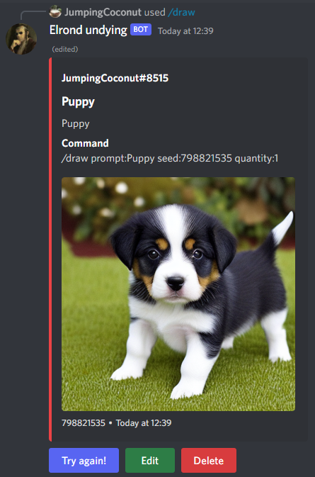
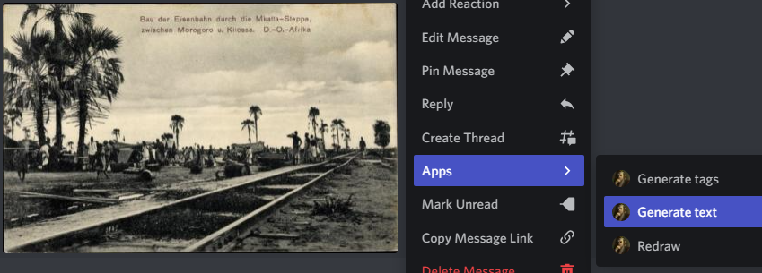
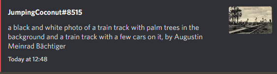
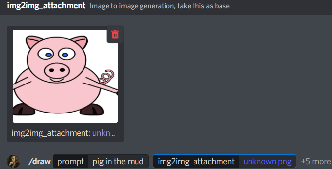
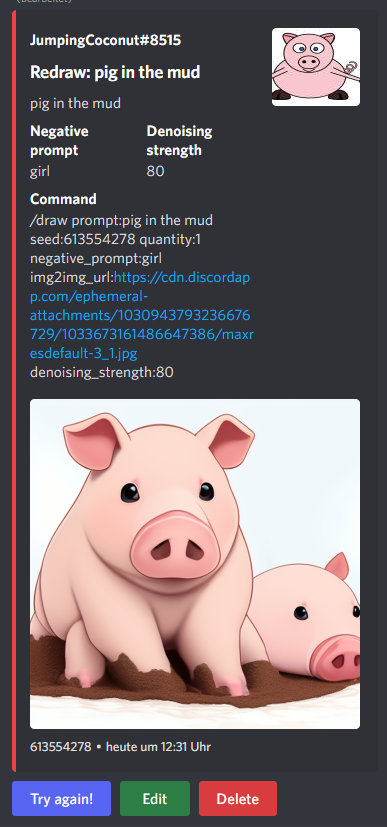
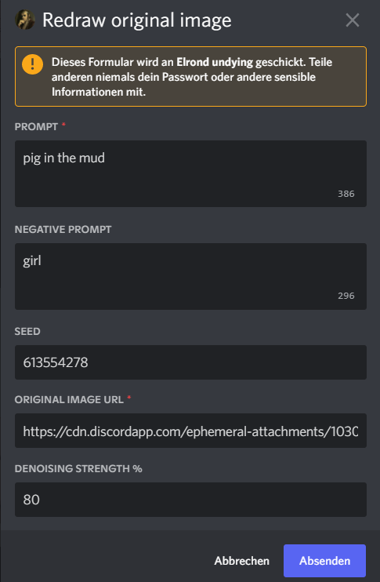
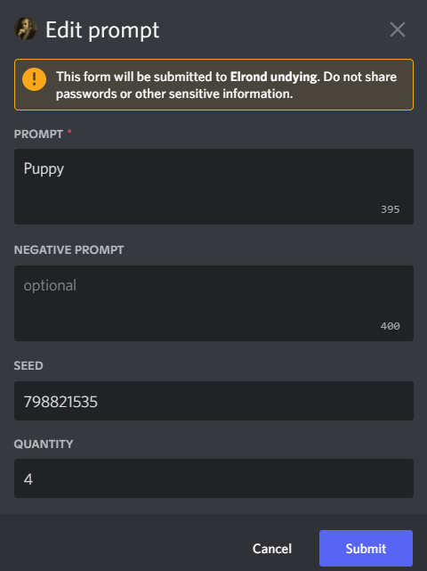
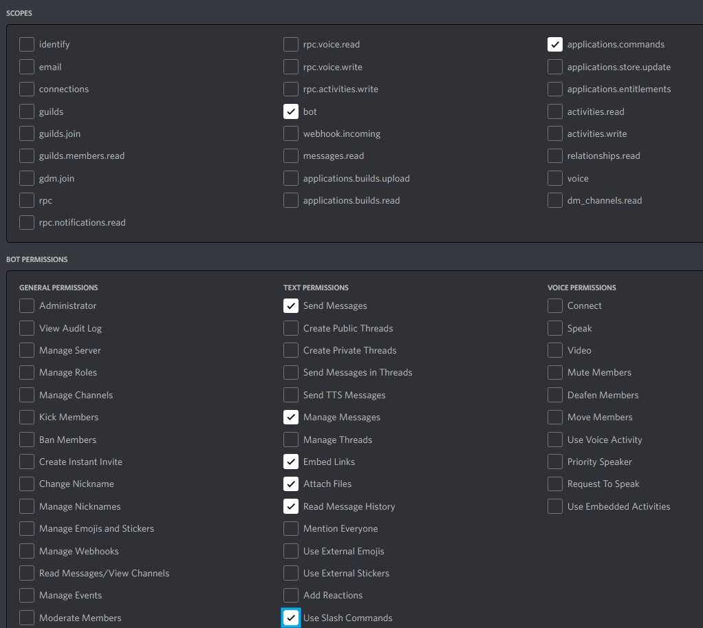

# Elrond-stable-diffusion-webui-discord
Integrates AUTOMATIC1111 stable-diffusion-webui into a discord bot for easily accessible use. 

Calls [AUTOMATIC1111/stable-diffusion-webui](https://github.com/AUTOMATIC1111/stable-diffusion-webui) and uses it through a discord bot. Add the bot to your server to access the webuis features through slash commands and right-click context menus.

It allows the discord users to generate stable diffusion images.

## Features

- Modern discord slash and button interface
- Generates images from text via stable diffusion webui
- Increases picture size via automatic upscaling (configurable, can be deactivated to save performance)
- Rightclick inspects existing images and gives their description and tags which can be useful to generate more images

- img2img via uploading or via rightclick

- Edit button to easily repost the previous pic with some changes

- Delete button, for the author only, to delete ugly or nsfw images that were accidentally generated in the wrong channel, so users dont have to call mods to delete the bot message
- Every user has their own background color when using the bot :)
- Communicates with the webui based on the current valid gradio interface which makes it slightly more future proof than direct HTTP posts
- (Future): Optional hivemind feature, to let willing people register their webuis in the bot, so that other users can generate images on their webui

## Install and Run

- Install [AUTOMATIC1111/stable-diffusion-webui (including Python 3.10)](https://github.com/AUTOMATIC1111/stable-diffusion-webui#installation-and-running)
- Create and invite your discord bot to a server (https://discord.com/developers/applications/). Make sure that under OAuth2, it has at least bot and applications.commands. Example: 
- Write the discord API key in your `.env` configuration file
- install all required python includes
  - either just run `install.bat` to create a python virtual environment and prepare it
  - or do it manually by checking `requirements.txt`
- *(optional)* enable the parameter `--deepdanbooru` in your `AUTOMATIC1111/stable-diffusion-webui/webui-user.bat`
- run your `AUTOMATIC1111/stable-diffusion-webui/webui-user.bat`
- start the bot
  - either just run `run-elrond.bat` to start it inside your python virtual environment
  - or do it manually by executing `elrond.py`
