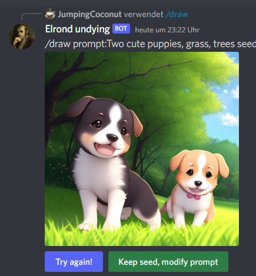
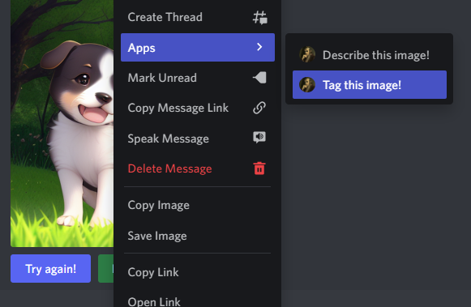
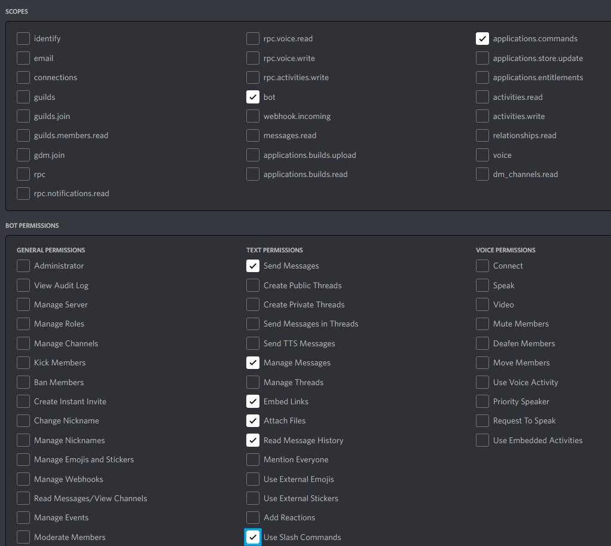

# Elrond-stable-diffusion-webui-discord
 Integrates AUTOMATIC1111 stable-diffusion-webui into a discord bot for easily accessible use. 

 Calls [AUTOMATIC1111/stable-diffusion-webui](https://github.com/AUTOMATIC1111/stable-diffusion-webui) and uses it through a discord bot. Add the bot to your server to access the webuis features through slash commands and right-click context menus.

It allows the discord users to generate stable diffusion images.

## Features

- Generates images and increases their size via upscaling
- Inspects existing images
- (Future) img2img via rightclick
- Modern discord slash and button interface

## Install and Run

- Install [AUTOMATIC1111/stable-diffusion-webui (including Python 3.10)](https://github.com/AUTOMATIC1111/stable-diffusion-webui#installation-and-running)
- Create and invite your discord bot to a server (https://discord.com/developers/applications/). Make sure that under OAuth2, it has at least bot and applications.commands. Example: 
- Write the discord API key in your `.env` configuration file
- install all required python includes
  - either just run `install.bat` to create a python virtual environment and prepare it
  - or do it manually by checking `requirements.txt`
- *(optional)* enable the parameter `--danbooru` in your `AUTOMATIC1111/stable-diffusion-webui/webui-user.bat`
- run your `AUTOMATIC1111/stable-diffusion-webui/webui-user.bat`
- start the bot
  - either just run `run-elrond.bat` to start it inside your python virtual environment
  - or do it manually by executing `elrond.py`
